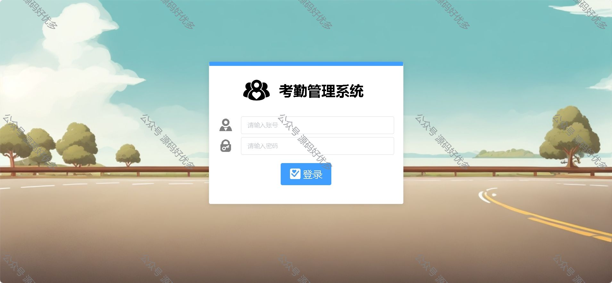
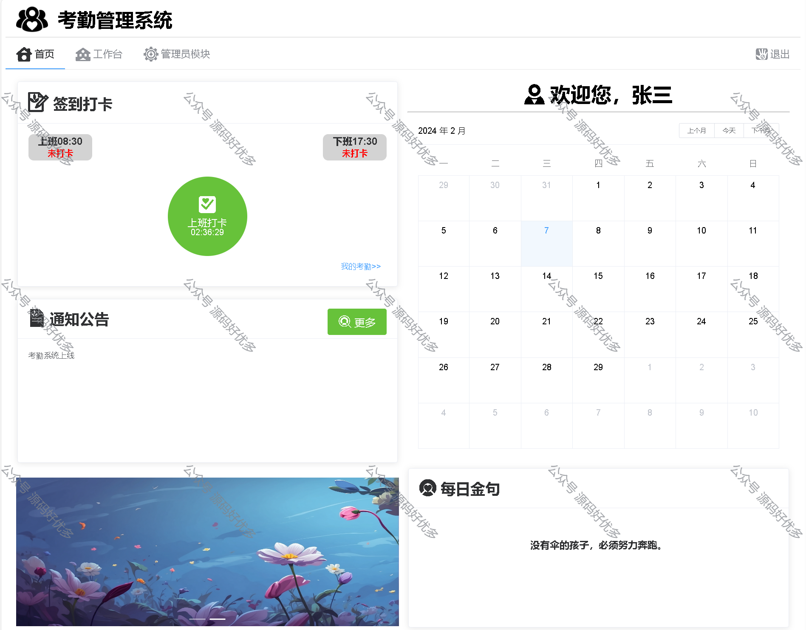
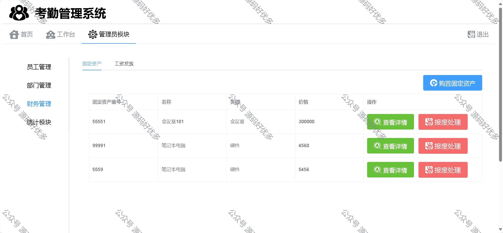
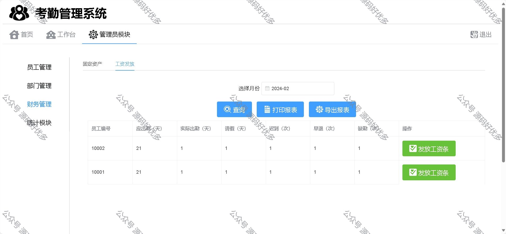
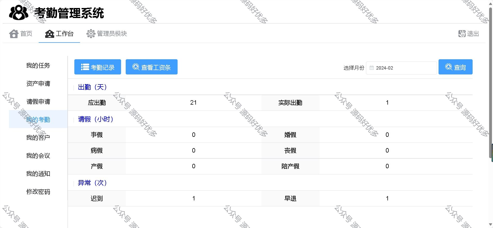
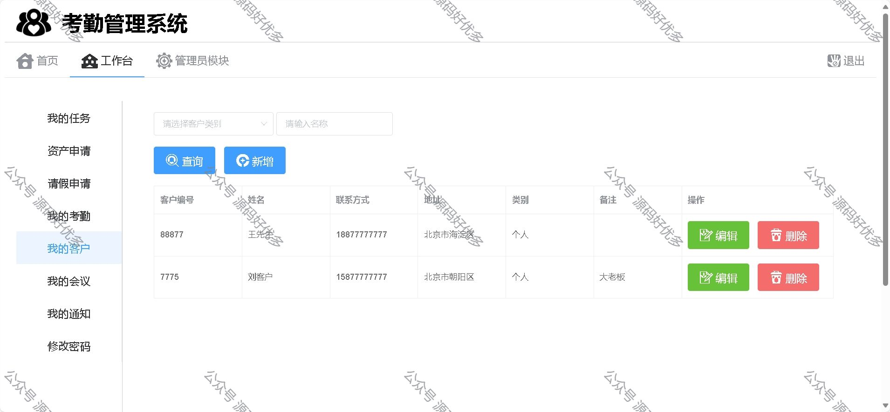
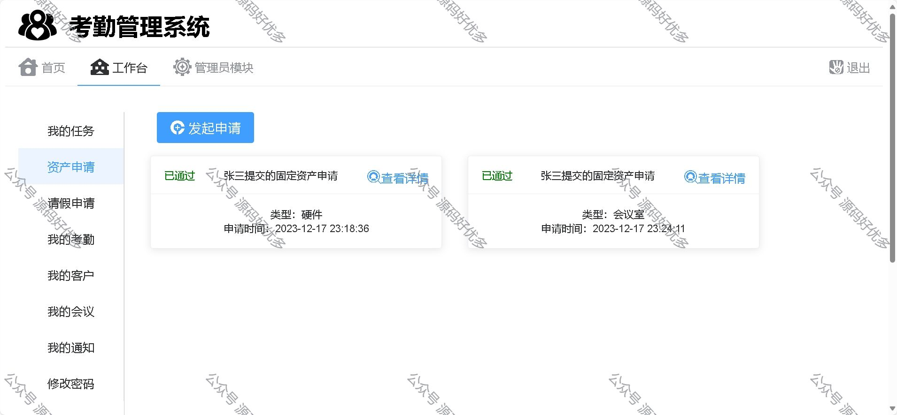
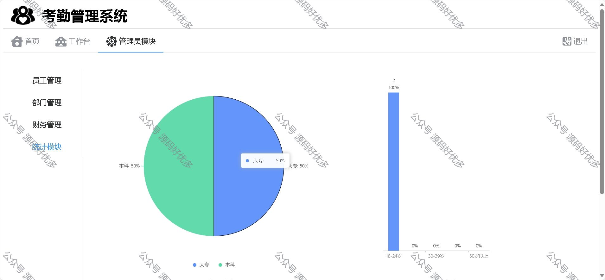
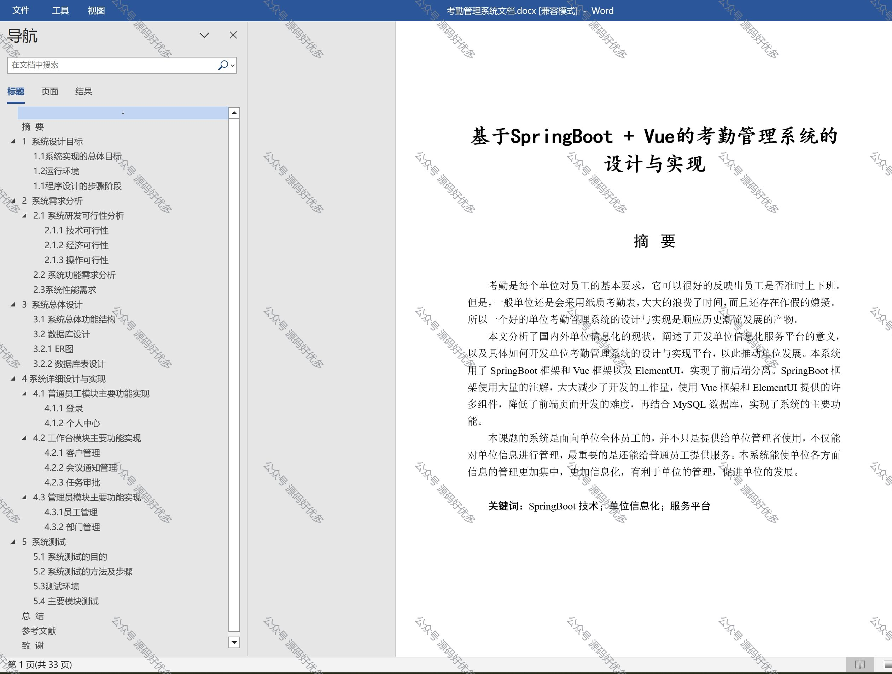

### 一、作品包含

源码+数据库+设计文档+全套环境和工具资源+部署教程

### 二、项目技术

前端技术：Html、Css、Js、Vue、Element-ui

数据库：MySQL

后端技术：Java、Spring Boot、MyBatis

### 三、运行环境

开发工具：IDEA/eclipse

数据库：MySQL8.0

数据库管理工具：Navicat10以上版本

环境配置软件： JDK1.8+Maven3.6.3

前端Nodejs：16

### 四、项目介绍

项目编号：springbootA011
考勤是每个单位对员工的基本要求，它可以很好的反映出员工是否准时上下班。但是，一般单位还是会采用纸质考勤表，大大的浪费了时间，而且还存在作假的嫌疑。所以一个好的单位考勤管理系统的设计与实现是顺应历史潮流发展的产物
普通员工功能：
登录、签到打卡、修改密码、提交申请：可提交请假申请，固定资产申请。查看消息：可查看领导发布的会议通知，查看申请情况。

工作台功能：
发布会议通知、任务审批、客户管理

管理员功能：
员工管理、部门管理、财务管理、查看统计信息

### 五、运行截图

